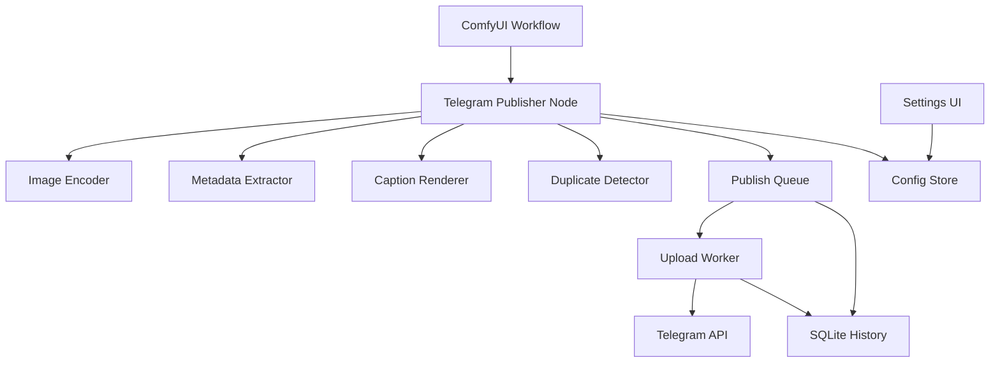

# Architecture

## 1. High-level architecture



## 2. Layering

### Node layer
Only adapts ComfyUI inputs/outputs to application services.

### Application/service layer
Contains publishing orchestration, retry policy, metadata extraction, caption rendering, duplicate detection, and queue behavior.

### Telegram integration layer
Owns HTTP calls to the Telegram Bot API. No ComfyUI imports here.

### Storage layer
Owns SQLite and configuration persistence.

### Frontend layer
Optional UI for settings/status. Keep business logic out of JavaScript.

## 3. Proposed repository

```text
ComfyUI-TelegramPublisher/
├── __init__.py
├── pyproject.toml
├── requirements.txt
├── README.md
├── LICENSE
├── publisher_nodes/
│   ├── __init__.py
│   ├── send_image.py
│   ├── send_album.py
│   └── send_message.py
├── telegram/
│   ├── client.py
│   ├── models.py
│   ├── errors.py
│   └── rate_limit.py
├── services/
│   ├── publisher.py
│   ├── encoder.py
│   ├── metadata.py
│   ├── captions.py
│   ├── dedup.py
│   ├── queue.py
│   └── retry.py
├── storage/
│   ├── config.py
│   ├── database.py
│   └── repositories.py
├── web/
│   └── settings.js
├── tests/
└── workflows/
```

## 4. Data flow

```text
IMAGE tensor
  -> validate
  -> convert/encode
  -> calculate hash
  -> extract metadata
  -> render caption
  -> create publish job
  -> queue
  -> Telegram client
  -> Telegram response
  -> persist result
```

## 5. Critical design rule

The Telegram client must never import ComfyUI modules. The ComfyUI node must never implement raw HTTP details.

## 6. Background execution

MVP may use synchronous publishing for the simplest reliable implementation. Background upload becomes P1 after correctness is established.

When background mode is implemented:
- persist the job before enqueueing;
- use a bounded queue;
- use a worker lifecycle tied to ComfyUI;
- never lose the local job record silently;
- expose queue state.

## 7. Security architecture

```text
Workflow JSON
    X bot token

Config Store
    -> bot token

Node
    -> account ID
    -> destination ID

Telegram Client
    -> resolves secret from config
    -> HTTPS request
```

Secrets must not appear in logs, node serialized state, exceptions, screenshots, or generated example workflows.

## 8. Compatibility strategy

Use the current ComfyUI custom-node scaffold and official extension conventions. Keep the business logic independent enough that changes to the ComfyUI API affect only the adapter/node layer.
